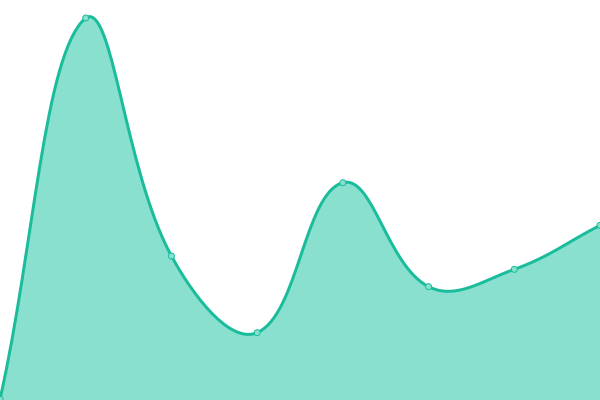
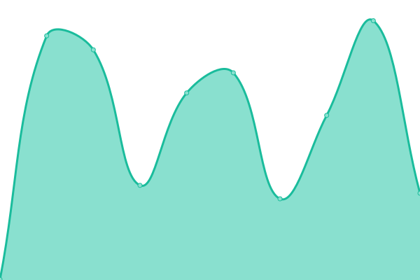

# [📈 Live Status](https://demo.upptime.js.org): <!--live status--> **🟩 All systems operational**

This repository contains the open-source uptime monitor and status page for [Upptime](https://upptime.js.org), powered by [Upptime](https://github.com/upptime/upptime).

With [Upptime](https://upptime.js.org), you can get your own unlimited and free uptime monitor and status page, powered entirely by a GitHub repository. We use [Issues](https://github.com/upptime/upptime/issues) as incident reports, [Actions](https://github.com/grantbevis/upptime/actions) as uptime monitors, and [Pages](https://demo.upptime.js.org) for the status page.

<!--start: status pages-->
<!-- This summary is generated by Upptime (https://github.com/upptime/upptime) -->
<!-- Do not edit this manually, your changes will be overwritten -->
<!-- prettier-ignore -->
| URL | Status | History | Response Time | Uptime |
| --- | ------ | ------- | ------------- | ------ |
|  [BBC](https://www.bbc.co.uk) | 🟩 Up | [bbc.yml](https://github.com/grantbevis/upptime/commits/HEAD/history/bbc.yml) | 

 238ms
     
 | 

<a href="https://status.bev.is/history/bbc">100.00%</a>
    

|  [Hacker News](https://news.ycombinator.com) | 🟩 Up | [hacker-news.yml](https://github.com/grantbevis/upptime/commits/HEAD/history/hacker-news.yml) | 

 199ms
     
 | 

<a href="https://status.bev.is/history/hacker-news">100.00%</a>
    

|  [VesselsValue](https://www.vesselsvalue.com) | 🟩 Up | [vessels-value.yml](https://github.com/grantbevis/upptime/commits/HEAD/history/vessels-value.yml) | 

 548ms
     
 | 

<a href="https://status.bev.is/history/vessels-value">100.00%</a>
    

|  [VesselsValue API](https://api.vesselsvalue.com) | 🟩 Up | [vessels-value-api.yml](https://github.com/grantbevis/upptime/commits/HEAD/history/vessels-value-api.yml) | 

 639ms
     
 | 

<a href="https://status.bev.is/history/vessels-value-api">100.00%</a>
    

<!--end: status pages-->

[**Visit our status website →**](https://demo.upptime.js.org)

## 📄 License

- Powered by: [Upptime](https://github.com/upptime/upptime)
- Code: [MIT](./LICENSE) © [Upptime](https://upptime.js.org)
- Data in the `./history` directory: [Open Database License](https://opendatacommons.org/licenses/odbl/1-0/)
